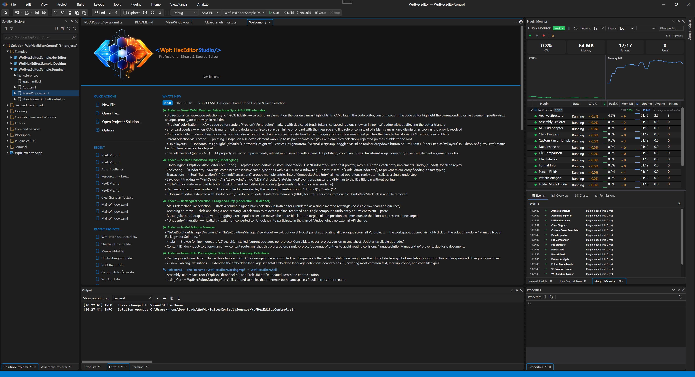
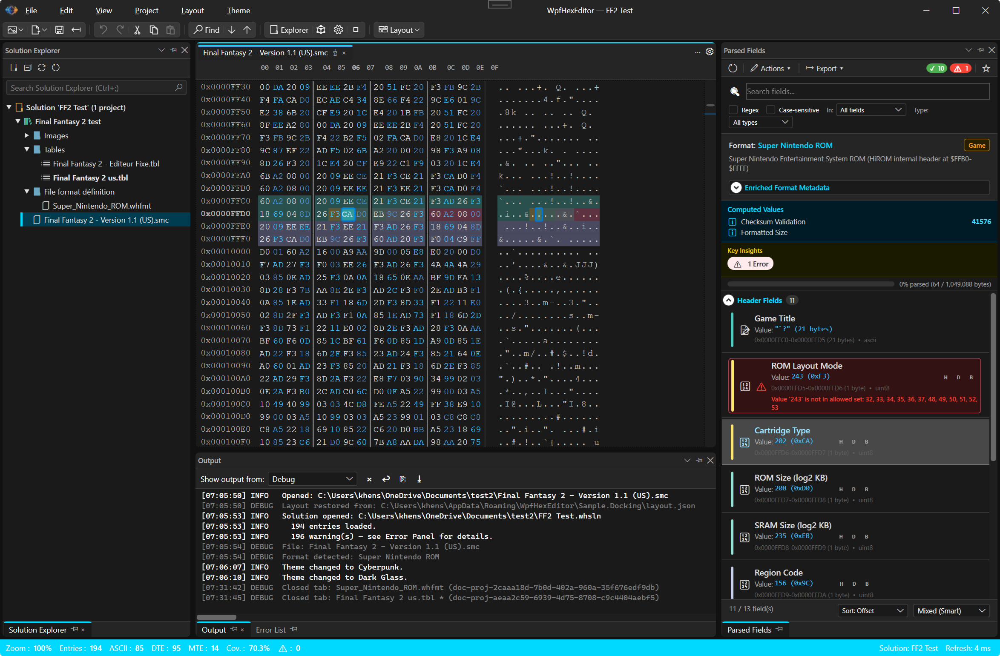
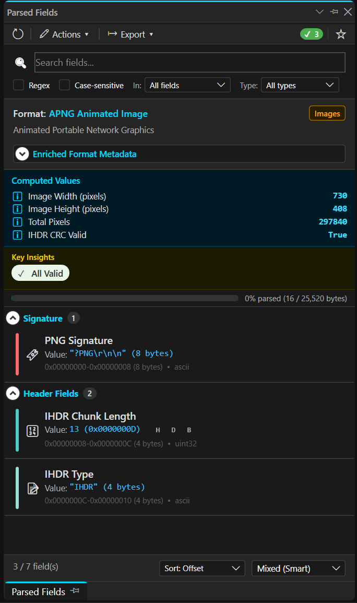
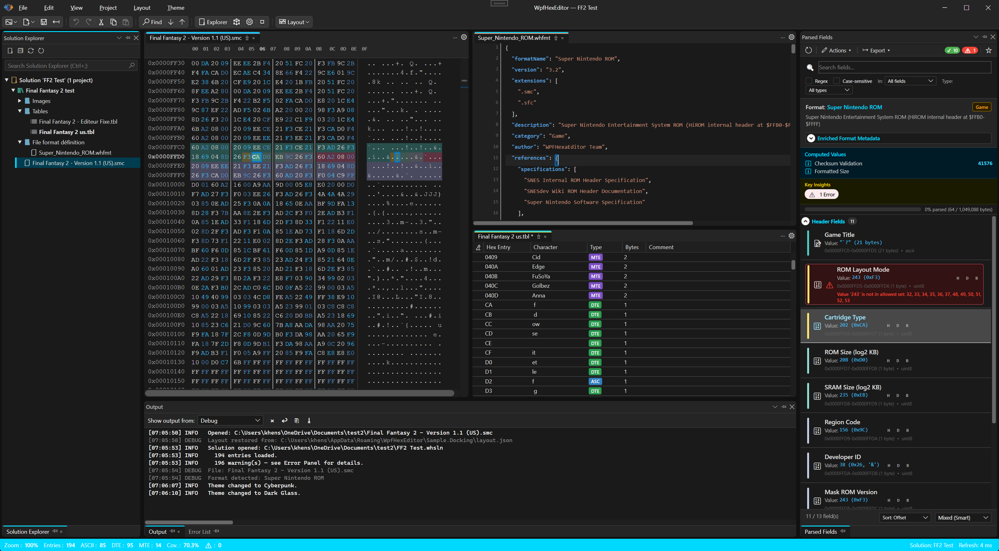
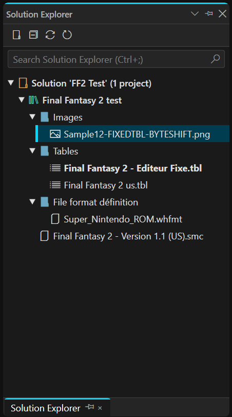
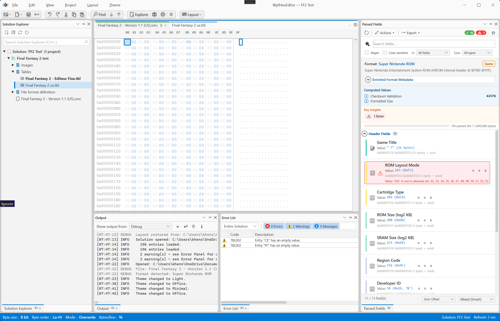
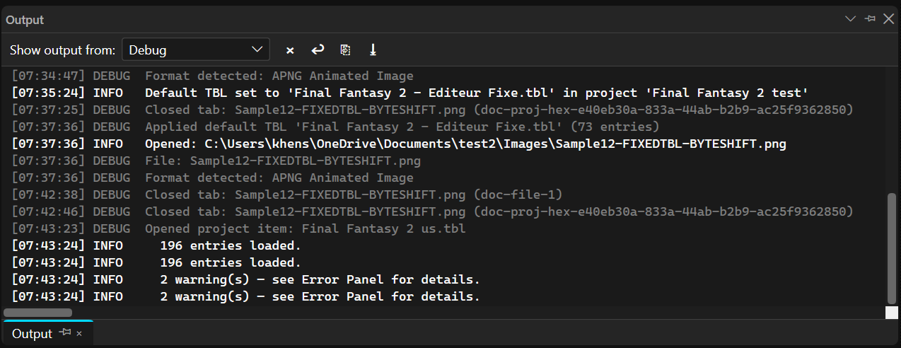
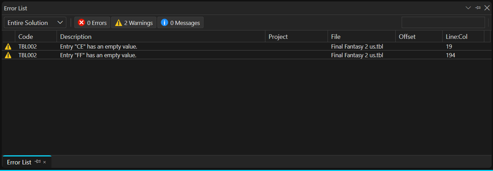
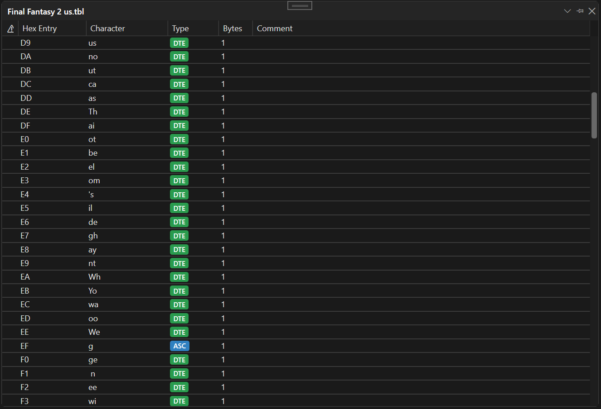

<div align="center">
  <a href="Images/Logo2026.png"></a>
  <br/><br/>

  <h3>A full-featured open-source IDE for .NET — Binary analysis, reverse engineering & build tooling</h3>

[](https://dotnet.microsoft.com/)
  [](https://github.com/abbaye/WpfHexEditorIDE)
  [](https://github.com/abbaye/WpfHexEditorIDE/releases)
  [](https://www.gnu.org/licenses/agpl-3.0)
  [](https://github.com/abbaye/WpfHexEditorIDE/commits/master)
  [](docs/ROADMAP.md)
  [](README.md#-ui-controls--nuget-packages)

  <br/>

  > 🚧 **Active Development** — New features, editors and panels are added regularly. Contributions welcome!
  >
  > 📅 *Last revised: 2026-04-28*

  <br/>

  <a href="Images/App-Editors-Welcome.png"></a>
  <br/>
  <sub><i>WpfHexEditor — Full IDE with VS-style docking, project system, and multiple editors</i></sub>

  <p>
    <a href="#-the-ide-application"><b>The IDE</b></a> •
    <a href="#-editors"><b>Editors</b></a> •
    <a href="#-standalone-controls--libraries"><b>Controls</b></a> •
    <a href="#-ide-panels"><b>Panels</b></a> •
    <a href="#-quick-start"><b>Quick Start</b></a> •
    <a href="#-documentation"><b>Docs</b></a> •
    <a href="docs/CHANGELOG.md"><b>Changelog</b></a>
  </p>
</div>

---

## 🖥️ The IDE Application

${\color{#2E7BDE}\texttt{<}}{\color{#E87A20}\texttt{WpfHexEditor}}\ {\color{#2E7BDE}\texttt{Studio/>}}$ is a full-featured binary analysis IDE for Windows, built with WPF and .NET 8.

| | |
|---|---|
| **🪟 Docking** | 100% in-house VS-style docking — float, dock, auto-hide, pin, **16 built-in themes**, colored tab strips, tab placement, layout undo/redo, serializable workspace state |
| **🏗️ Project System** | Open `.whsln`/`.whproj` or Visual Studio `.sln`/`.csproj` — MSBuild build/rebuild/clean, parallel compilation, project templates, per-file editor state persistence |
| **📐 `.whfmt` Format Language** | Data-driven IDE heart — **790+ definitions** (schema v2.4). Controls: which editor opens a file · how binary formats are parsed · how languages behave in the code editor · how formats are auto-detected. Add a new file type with a `.whfmt` file — no C# needed. Also available as [`whfmt.FileFormatCatalog`](https://www.nuget.org/packages/whfmt.FileFormatCatalog/) on NuGet. |
| **🔍 Binary Intelligence** | 790+ format auto-detection, Parsed Fields panel, format field color overlay, Data Inspector (40+ type interpretations), Assembly Explorer with ILSpy decompilation |
| **🧠 Code Intelligence** | In-process Roslyn for C#/VB.NET — full LSP 3.17 client (13 provider types: completion, hover, signature help, code actions, rename, inlay hints, code lens, semantic tokens, call/type hierarchy, pull diagnostics, linked editing) |
| **🤖 AI Assistant** | Multi-provider AI chat (Anthropic, OpenAI, Gemini, Ollama, Claude Code CLI) — 25 MCP tools, streaming responses, inline code apply, `@mentions` for context injection, conversation history |
| **🔌 Plugin System** | SDK 2.0.0 (API frozen, semver) — `.whxplugin` format, Plugin Manager, typed EventBus (39+ events), capability registry, out-of-process sandbox — **28 built-in plugins**. Lazy/standby loading via manifest-driven stubs |
| **⌨️ Command & Terminal** | Command Palette (`Ctrl+Shift+P`, 9 search modes), ~100 registered commands, configurable shortcuts, integrated multi-tab terminal (`Ctrl+\``) with 35+ built-in commands |
| **🐞 .NET Debugger** *(~60%)* | Debug menu, toolbar, execution line highlight, full breakpoint system (conditions, hit counts, persistence), Breakpoint Explorer — *runtime attach pending* |
| **🧪 Unit Testing** | Auto-detects xunit/nunit/mstest, runs via `dotnet test`, TRX result parsing, pass/fail/skip counters, auto-run on build |
| **📋 IDE Infrastructure** | Shared undo engine, rectangular block selection, adaptive status bar, 30+ options pages, workspace system (`.whidews`), tab groups, Window menu, Full Screen (`F11`), NuGet Solution Manager |

---

## 📝 Editors

Every editor is a standalone `IDocumentEditor` plugin — reusable outside the IDE.

| Editor | Progress | Description |
|--------|----------|-------------|
| **[Code Editor](Sources/WpfHexEditor.Editor.CodeEditor/README.md)** | ~90% | 55+ languages, Roslyn C#/VB.NET, LSP 3.17 (13 providers), sticky scroll, multi-caret, folding, minimap, split view, inline hints |
| **[TBL Editor](Sources/WpfHexEditor.Editor.TblEditor/README.md)** | ~45% | Custom `.tbl` encoding tables for ROM hacking, bidirectional hex↔text preview |
| **[Hex Editor](Sources/WpfHexEditor.HexEditor/README.md)** | ~70% | Binary editor — insert/overwrite, 790+ format auto-detection, multi-mode search, bookmarks, block undo/redo |
| **[Diff / Changeset Viewer](Sources/WpfHexEditor.Editor.DiffViewer/README.md)** | ~65% | Binary, text, and structure diff — GlyphRun renderers, word-level highlight, Myers/Binary/Semantic algorithms |
| **[Markdown Editor](Sources/WpfHexEditor.Editor.MarkdownEditor/README.md)** | ~50% | Live preview, mermaid.js diagrams, clipboard image paste, document outline |
| **[XAML Designer](Sources/WpfHexEditor.Editor.XamlDesigner/README.md)** | ~40% | Live canvas, bidirectional XAML↔design sync, property inspector, snap grid, undo/redo |
| **[Image Viewer](Sources/WpfHexEditor.Editor.ImageViewer/README.md)** | ~40% | Zoom/pan, rotate/flip/crop/resize, supports PNG/JPEG/BMP/GIF/TIFF |
| **[Text Editor](Sources/WpfHexEditor.Editor.TextEditor/README.md)** | ~40% | Plain text with 26 embedded language definitions, encoding support, search |
| **[Script Editor](Sources/WpfHexEditor.Editor.ScriptEditor/README.md)** | ~40% | C#Script with Roslyn SmartComplete, IDE globals injection, automation |
| **[Document Editor](Sources/WpfHexEditor.Editor.DocumentEditor/README.md)** | ~35% | WYSIWYG RTF/DOCX/ODT editing, formatting toolbar, tables, find/replace |
| **[Entropy Viewer](Sources/WpfHexEditor.Editor.EntropyViewer/README.md)** | ~30% | Graphical entropy and byte-frequency charts, click-to-navigate |
| **[Structure Editor](Sources/WpfHexEditor.Editor.StructureEditor/README.md)** | ~40% | Visual `.whfmt` editor — block DataGrid, drag-drop, validation, TestTab, live binary preview |
| **[Class Diagram](Sources/WpfHexEditor.Editor.ClassDiagram/README.md)** | ~50% | UML diagram — syntax-highlighted DSL, 3 layout strategies, interactive canvas, minimap, session persistence |
| **[JSON Editor](Sources/WpfHexEditor.Editor.JsonEditor/README.md)** | ~20% | JSON syntax highlighting, auto-detection |
| **[Resx Editor](Sources/WpfHexEditor.Editor.ResxEditor/README.md)** | ~20% | `.resx` resource editor — key/value grid |
| **[Disassembly Viewer](Sources/WpfHexEditor.Editor.DisassemblyViewer/README.md)** | ~12% | x86/x64/ARM disassembly via Iced, GlyphRun canvas renderer |
| **[Audio Viewer](Sources/WpfHexEditor.Editor.AudioViewer/README.md)** | ~10% | Waveform rendering for WAV/MP3/FLAC/OGG/AIFF |
| **[Tile Editor](Sources/WpfHexEditor.Editor.TileEditor/README.md)** | ~5% | Tile/sprite editor for ROM assets — planned (#175) |
| **Decompiled Source Viewer** | ~0% | ILSpy C#/IL decompilation viewer — planned (#106) |
| **Memory Snapshot Viewer** | ~0% | Windows `.dmp` / Linux core-dump inspection — planned (#117) |
| **PCAP Viewer** | ~0% | `.pcap`/`.pcapng` packet dissection — planned (#136) |

> New editor? See [IDocumentEditor contract](Sources/WpfHexEditor.Editor.Core/README.md) and register via `EditorRegistry`.

---

## 🧩 Standalone Controls & Libraries

All controls are **independently reusable** — no IDE required.

### 📦 UI Controls & NuGet Packages

| Control | NuGet | Description |
|---------|-------|-------------|
| **[Hex Editor](Sources/WpfHexEditor.HexEditor/README.md)** | [](https://www.nuget.org/packages/WPFHexaEditor/) | Binary editor — insert/overwrite, 790+ format detection, search, bookmarks, undo/redo |
| **[Code Editor](Sources/WpfHexEditor.Editor.CodeEditor/README.md)** | [](https://www.nuget.org/packages/WpfCodeEditor/) | Source editor — 400+ languages, LSP 3.17, folding, multi-caret, minimap, split view |
| **[Docking](Sources/Docking/WpfHexEditor.Docking.Wpf/README.md)** | [](https://www.nuget.org/packages/WpfDocking/) | VS Code-style docking — panels, documents, drag-drop, themes, layout persistence |
| **[Color Picker](Sources/WpfHexEditor.ColorPicker/README.md)** | [](https://www.nuget.org/packages/WpfColorPicker/) | HSV wheel, RGB/HSL sliders, hex input, palettes, eyedropper, opacity |
| **[Terminal](Sources/WpfHexEditor.Terminal/README.md)** | [](https://www.nuget.org/packages/WpfTerminal/) | Multi-tab shell emulator — cmd/PowerShell/bash, 35+ built-in commands |
| **[FileFormatCatalog](Sources/Core/WpfHexEditor.Core.Definitions/README.md)** | [](https://www.nuget.org/packages/whfmt.FileFormatCatalog/) | 790+ format definitions, magic-byte detection, 57 syntax grammars — **cross-platform `net8.0`** |
| **[HexBox](Sources/WpfHexEditor.HexBox/README.md)** | — | Lightweight single-value hex input field |
| **[ProgressBar](Sources/WpfHexEditor.ProgressBar/README.md)** | — | Animated progress indicator, determinate/indeterminate, themeable |

```bash
dotnet add package WPFHexaEditor              # Hex editor control
dotnet add package WpfCodeEditor              # Code editor control
dotnet add package WpfDocking                 # Docking framework
dotnet add package WpfColorPicker             # Color picker control
dotnet add package WpfTerminal                # Terminal control
dotnet add package whfmt.FileFormatCatalog    # 790+ format definitions (cross-platform net8.0)
```

> UI packages target **.NET 8.0-windows** · `whfmt.FileFormatCatalog` targets **cross-platform `net8.0`**. All packages bundle dependencies — zero external NuGet deps, XML IntelliSense + SourceLink included.

### Libraries

| Library | Description |
|---------|-------------|
| **[Core](Sources/WpfHexEditor.Core/README.md)** | Foundation — ByteProvider, 16 injectable services (search, replace, bookmark, undo…), format detection |
| **[Editor.Core](Sources/WpfHexEditor.Editor.Core/README.md)** | Shared editor infra — `IDocumentEditor` contract, editor registry, shared `UndoEngine` |
| **[BinaryAnalysis](Sources/WpfHexEditor.BinaryAnalysis/README.md)** | Binary engine — 790+ format signatures, `.whfmt` parser, type decoders, DataInspector (40+ types) |
| **[Definitions](Sources/Core/WpfHexEditor.Core.Definitions/README.md)** | Embedded catalog — 790+ formats (schema v2.4), 57 syntax grammars, 27 categories; published as [`whfmt.FileFormatCatalog`](https://www.nuget.org/packages/whfmt.FileFormatCatalog/) |
| **[Events](Sources/WpfHexEditor.Events/README.md)** | Typed pub/sub event bus — 39+ domain events, weak references, cross-process IPC bridge |
| **[SDK](Sources/WpfHexEditor.SDK/README.md)** | Plugin SDK (SemVer 2.0.0 frozen) — `IWpfHexEditorPlugin`, `IIDEHostContext`, 15+ extension contracts |
| **[Core.Roslyn](Sources/WpfHexEditor.Core.Roslyn/README.md)** | In-process Roslyn — C#/VB.NET incremental analysis, replaces external OmniSharp |
| **[Core.LSP.Client](Sources/WpfHexEditor.Core.LSP.Client/README.md)** | LSP 3.17 client — full JSON-RPC transport, 13 provider types, document sync |
| **[Core.Diff](Sources/WpfHexEditor.Core.Diff/README.md)** | Diff engine — Myers, binary, semantic algorithms, Git integration, HTML/patch export |
| **[Core.Workspaces](Sources/WpfHexEditor.Core.Workspaces/README.md)** | Workspace persistence — `.whidews` (ZIP+JSON): dock layout, files, theme, solution |
| **[Core.MCP](Sources/WpfHexEditor.Core.MCP/README.md)** | Model Context Protocol — JSON-RPC tool definitions for AI assistant IDE integration |
| **[Core.BuildSystem](Sources/WpfHexEditor.Core.BuildSystem/README.md)** | Build orchestration — MSBuild API, parallel builds, incremental dirty tracking |
| **[Core.Debugger](Sources/WpfHexEditor.Core.Debugger/README.md)** | .NET debug adapter — breakpoint management, step over/into/out, variable evaluation |
| **[Core.Scripting](Sources/WpfHexEditor.Core.Scripting/README.md)** | Script execution — C#Script via Roslyn, IDE globals injection, REPL |
| **[Core.Terminal](Sources/WpfHexEditor.Core.Terminal/README.md)** | Terminal command engine — 35+ built-in commands, history, extensible via `ITerminalService` |
| **[Core.Commands](Sources/WpfHexEditor.Core.Commands/README.md)** | Command registry — ~100 commands, configurable shortcuts, Command Palette |
| **[Core.SourceAnalysis](Sources/WpfHexEditor.Core.SourceAnalysis/README.md)** | Lightweight source outline — regex-based type/member extraction, BCL-only |
| **[Core.AssemblyAnalysis](Sources/WpfHexEditor.Core.AssemblyAnalysis/README.md)** | .NET assembly inspector — `System.Reflection.Metadata` PEReader, BCL-only |
| **[Core.Decompiler](Sources/WpfHexEditor.Core.Decompiler/README.md)** | Decompilation service — `IDecompiler` + ILSpy backend, C#/VB.NET output |
| **[ProjectSystem](Sources/WpfHexEditor.ProjectSystem/README.md)** | Project model — `.whsln`/`.whproj` + VS `.sln`/`.csproj`, references, templates |
| **[PluginHost](Sources/WpfHexEditor.PluginHost/README.md)** | Plugin lifecycle — discovery, ALC-isolated loading, health watchdog, hot-reload |
| **[PluginSandbox](Sources/WpfHexEditor.PluginSandbox/README.md)** | Out-of-process isolation — HWND embedding, bidirectional IPC, Job Object limits |
| **[Docking.Core](Sources/WpfHexEditor.Docking.Core/README.md)** | Docking engine — layout model, serializable state, dock/float/auto-hide/tab groups |
| **[Options](Sources/WpfHexEditor.Options/README.md)** | Settings framework — JSON persistence, tree UI, 20+ pages, plugin-extensible |

---

## 🗂️ IDE Panels

| Panel | Progress | Description |
|-------|----------|-------------|
| **[AI Assistant](Sources/Plugins/WpfHexEditor.Plugins.AIAssistant/README.md)** | ~80% | 5 AI providers, 25 MCP tools, streaming, inline code apply, @mentions, history |
| **[Solution Explorer](Sources/WpfHexEditor.Panels.IDE/README.md)** | ~75% | Project tree — virtual/physical folders, drag-drop, lazy source outline |
| **[Options](Sources/WpfHexEditor.Options/README.md)** | ~70% | 30+ settings pages, searchable, plugin-extensible |
| **[Output](Sources/WpfHexEditor.Panels.IDE/README.md)** | ~70% | Build and log output — severity-colored messages, auto-scroll |
| **[Parsed Fields](Sources/Plugins/WpfHexEditor.Plugins.ParsedFields/README.md)** | ~65% | Binary structure viewer — 790+ format parsing, expandable field tree, forensic alerts |
| **[Data Inspector](Sources/Plugins/WpfHexEditor.Plugins.DataInspector/README.md)** | ~60% | 40+ type interpretations at caret — live update on navigation |
| **[Call Hierarchy](Sources/Plugins/WpfHexEditor.Plugins.LSPTools/README.md)** | ~65% | LSP call chain navigator (`Shift+Alt+H`) |
| **[Type Hierarchy](Sources/Plugins/WpfHexEditor.Plugins.LSPTools/README.md)** | ~65% | LSP inheritance viewer (`Ctrl+Alt+F12`) |
| **[Error List](Sources/WpfHexEditor.Panels.IDE/README.md)** | ~65% | Diagnostic aggregator — errors/warnings from all editors and builds |
| **[Terminal](Sources/WpfHexEditor.Terminal/README.md)** | ~65% | Multi-tab shell (`Ctrl+\``) — 35+ commands, ANSI colors, plugin-extensible |
| **[Unit Testing](Sources/Plugins/WpfHexEditor.Plugins.UnitTesting/README.md)** | ~60% | xunit/nunit/mstest runner, pass/fail/skip counters, auto-run on build |
| **[Document Structure](Sources/Plugins/WpfHexEditor.Plugins.DocumentStructure/README.md)** | ~55% | VS-style outline — 8 providers (LSP/JSON/XML/Markdown/INI/Binary/Folding/Outline) |
| **[File Comparison](Sources/Plugins/WpfHexEditor.Plugins.FileComparison/README.md)** | ~55% | File diff launcher — synchronized scrolling, DiffHub panel |
| **[Breakpoint Explorer](Sources/WpfHexEditor.Panels.IDE/README.md)** | ~55% | Breakpoint management — conditions, hit counts, toggle, jump to source |
| **[Plugin Manager](Sources/WpfHexEditor.PluginHost/README.md)** | ~55% | Browse, enable/disable, uninstall plugins |
| **[Format Info](Sources/Plugins/WpfHexEditor.Plugins.FormatInfo/README.md)** | ~50% | Detected format name, MIME type, magic bytes, section list |
| **[File Statistics](Sources/Plugins/WpfHexEditor.Plugins.FileStatistics/README.md)** | ~50% | Byte-frequency chart, Shannon entropy, file size breakdown |
| **[Properties](Sources/WpfHexEditor.Panels.IDE/README.md)** | ~50% | Context-aware property inspector (`F4`) |
| **[Plugin Monitoring](Sources/WpfHexEditor.Panels.IDE/README.md)** | ~50% | Per-plugin CPU/memory charts |
| **[Git Integration](Sources/Plugins/WpfHexEditor.Plugins.Git/README.md)** | ~40% | Stage/unstage/commit/push/pull, branch picker, stash, history panel, blame gutter — *not yet integration-tested* |
| **[Archive Explorer](Sources/Plugins/WpfHexEditor.Plugins.ArchiveStructure/README.md)** | ~45% | Browse ZIP/7z/TAR as trees, extract, preview in hex view |
| **[Structure Overlay](Sources/Plugins/WpfHexEditor.Plugins.StructureOverlay/README.md)** | ~40% | Color-code binary fields on the hex grid from `.whfmt` definitions |
| **[Pattern Analysis](Sources/Plugins/WpfHexEditor.Plugins.PatternAnalysis/README.md)** | ~35% | Detect byte sequences, data structures, and anomalies for reverse engineering |
| **[Assembly Explorer](Sources/Plugins/WpfHexEditor.Plugins.AssemblyExplorer/README.md)** | ~30% | Browse .NET assemblies, decompile to C#/VB.NET in a Code Editor tab |
| **[Custom Parser Template](Sources/Plugins/WpfHexEditor.Plugins.CustomParserTemplate/README.md)** | ~25% | Template-driven binary parser (010 Editor-style `.bt`) |

---

## 📸 Screenshots

<div align="center">
  <b>🖥️ IDE Overview</b><br/>
  <sub>VS-style docking with Solution Explorer, HexEditor and ParsedFieldsPanel</sub><br/><br/>
  <a href="Images/App-IDE-Overview.png"></a>
</div>

<details>
<summary>More screenshots</summary>
<br/>

| | |
|---|---|
| <a href="Images/App-ParsedFields.png"></a><br/><sub>🔬 Parsed Fields — 790+ format detection</sub> | <a href="Images/App-Editors.png"></a><br/><sub>📝 Multi-Editor Tabs</sub> |
| <a href="Images/App-SolutionExplorer.png"></a><br/><sub>🗂️ Solution Explorer</sub> | <a href="Images/App-Theme-Light.png"></a><br/><sub>☀️ Light Theme (16 built-in themes)</sub> |
| <a href="Images/App-Output.png"></a><br/><sub>📤 Output Panel</sub> | <a href="Images/App-ErrorList.png"></a><br/><sub>🔴 Error Panel</sub> |
| <a href="Images/App-TBLEditor.png"></a><br/><sub>📋 TBL Editor</sub> | <a href="Images/TBLExplain.png"></a><br/><sub>🎮 TBL Format</sub> |

</details>

---

## ⚡ Quick Start

**Run the IDE:**
```bash
git clone https://github.com/abbaye/WpfHexEditorIDE.git
```
Open `WpfHexEditorControl.sln`, set **WpfHexEditor.App** as startup project, press F5.

> Developed on **Visual Studio 2026**. Compatible with **VS 2022** (v17.8+) and **JetBrains Rider**.

**Embed the HexEditor in your WPF app:**
```xml
<ProjectReference Include="..\WpfHexEditor.Core\WpfHexEditor.Core.csproj" />
<ProjectReference Include="..\WpfHexEditor.HexEditor\WpfHexEditor.HexEditor.csproj" />
```
```xml
<Window xmlns:hex="clr-namespace:WpfHexEditor.HexEditor;assembly=WpfHexEditor.HexEditor">
  <hex:HexEditor FileName="data.bin" />
</Window>
```

> **[Complete Tutorial →](docs/GETTING_STARTED.md)** · **[NuGet Packages →](#-ui-controls--nuget-packages)**

---

## 🗺️ Roadmap

> Full details: **[ROADMAP.md](docs/ROADMAP.md)** · **[CHANGELOG.md](docs/CHANGELOG.md)**

**In Progress:**

| Feature | Status | # |
|---------|--------|---|
| **Code Editor** — remaining: inline debug value overlay | 🔧 ~75% | #84 |
| **LSP Engine** — remaining: inline value hints, pull-diagnostics | 🔧 ~65% | #85–86 |
| **MSBuild & VS Solution** — remaining: VB.NET item groups, nested solution folders | 🔧 ~70% | #101–103 |
| **Assembly Explorer** — remaining: panel improvements, PDB source-link | 🔧 ~55% | #104–106 |
| **.NET Debugger** — UI complete, remaining: runtime attach | 🔧 ~30% | #44, #90 |
| **Git Integration** — UI in place, not yet integration-tested | 🔧 ~40% | #91 |
| **Structure Editor** — remaining: live binary sync, complex types | 🔧 ~30% | #172 |
| **Plugin Sandbox** — remaining: gRPC migration, hot-reload | 🔧 ~40% | #81 |

**Planned:**

| Feature | # |
|---------|---|
| Editors Phase 2 — TextEditor LSP, 3-way merge, TileEditor pixel tools | #169–178 |
| Plugin Marketplace & Auto-Update | #41–43 |
| IDE Localization (EN/FR initial) | #100 |
| Installable Package (MSI/MSIX/WinGet) | #109 |
| Official Website | #108 |

<details>
<summary>✅ Completed features</summary>

| Feature | Version |
|---------|---------|
| **whfmt.FileFormatCatalog v1.1.1** — `CatalogQuery` fluent API, `FormatMatcher`, `FormatFileAnalyzer`, `FormatSummaryBuilder` | v0.6.4.122 |
| **WpfCodeEditor v0.9.7.0** — folding engine rewrite (visible-rank/physical-index separation, stale-frame guide fix, session restore via `ToggleRegion`) | v0.6.4.122 |
| **WPFHexaEditor v3.1.4** — 790+ formats, schema v2.4, 57 grammars, LSP `IsFullyLoaded` gate, ParsedFields sync | v0.6.4.122 |
| **WpfDocking v0.9.6.0** — `TrackActivation` on tab-group focus, multi-tab-group panel sync | v0.6.4.122 |
| **ParsedFields source selector** — lazy-load, standalone analysis, multi-tab-group sync | v0.6.4.82 |
| **LSP `IsFullyLoaded` gate** — suppresses init-time diagnostic noise | v0.6.4.82 |
| **whfmt.FileFormatCatalog v1.0.0** — cross-platform `net8.0`, `EmbeddedFormatCatalog`, `DetectFromBytes`, 27 categories | v0.6.4.75 |
| **790+ `.whfmt` format definitions** — schema v2.4, forensic patterns, variables, references, 57 syntax grammars | v0.6.4.75 |
| **Structure Editor** — block DataGrid, drag-drop, validation, TestTab, SmartComplete | v0.6.4.75 |
| **HexEditor ↔ CodeEditor Shared Undo** — unified `UndoEngine`, `IUndoAwareEditor` | v0.6.4.10 |
| **Tab Groups** — `ITabGroupService`, split H/V, 16 `TG_*` theme tokens, 77 integration tests | v0.6.4.6 |
| **Lazy Plugin Loading** — manifest stubs, single-click activation, state persistence | v0.6.4.6 |
| **Window Menu + Full Screen** — Close All, Next/Prev Document, `F11` via Win32 | v0.6.4.8 |
| **AI Assistant** — 5 providers, 25 MCP tools, streaming, @mentions | v0.6.4.3 |
| **Roslyn Integration** — in-process C#/VB.NET, replaces OmniSharp | v0.6.4.3 |
| **LSP Engine** — full LSP 3.17 client, 13 provider types | v0.6.3.6 |
| **Command Palette** — `Ctrl+Shift+P`, 9 search modes | v0.6.3.6 |
| **VS Solution + MSBuild** — open VS solutions, build/rebuild/clean | v0.5.0 |

</details>

---

## 📚 Documentation

| | |
|---|---|
| **[GETTING_STARTED.md](docs/GETTING_STARTED.md)** | Run the IDE or embed the control |
| **[FEATURES.md](docs/FEATURES.md)** | Complete feature list |
| **[CHANGELOG.md](docs/CHANGELOG.md)** | Version history |
| **[MIGRATION.md](docs/migration/MIGRATION.md)** | Legacy V1 → V2 migration |
| **[Architecture Overview](docs/architecture/Overview.md)** | Services, MVVM, data flow |
| **[whfmt.FileFormatCatalog Guide](doc/whfmt-FileFormatCatalog-guide.md)** | API reference, architecture, integration guides |
| **[API Reference](docs/api-reference/)** | Full API docs |
| **[Wiki](https://github.com/abbaye/WpfHexEditorIDE/wiki/Getting-Started)** | Getting started |

---

## 🔧 Requirements

**.NET 8.0-windows** — .NET Framework 4.8 is no longer supported (use legacy `WPFHexaEditor` NuGet for .NET Framework).

HexEditor control supports **19 UI languages** with instant runtime switching. IDE UI is English only — localization planned (#100).

---

## ⭐ Support & Contributing

${\color{#2E7BDE}\texttt{<}}{\color{#E87A20}\texttt{WpfHexEditor}}\ {\color{#2E7BDE}\texttt{Studio/>}}$ is **100% free and open source** (GNU AGPL v3.0).

- ⭐ **Star this repo** — helps others discover it
- 🍴 **Fork & contribute** — see **[CONTRIBUTING.md](.github/CONTRIBUTING.md)**
- 🐛 **Bug reports** — [GitHub Issues](https://github.com/abbaye/WpfHexEditorIDE/issues)
- 💡 **Feature requests** — [GitHub Discussions](https://github.com/abbaye/WpfHexEditorIDE/discussions)
- 📧 **Email** — derektremblay666@gmail.com

---

<div align="center">
  <sub>Built with ❤️ by the WpfHexEditor community · AGPL v3.0</sub>
</div>
