# Avalonia Architecture - Visual Design

## 📐 Complete Architecture Overview

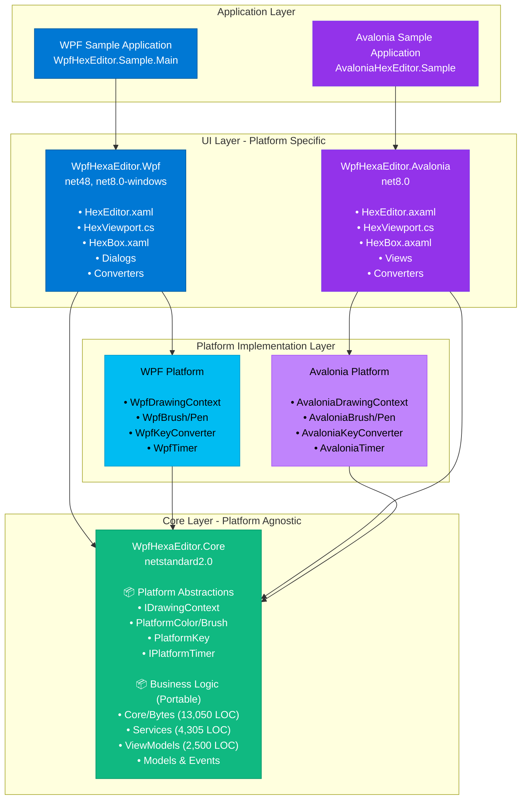

---

## 🗂️ Project Structure with Dependencies

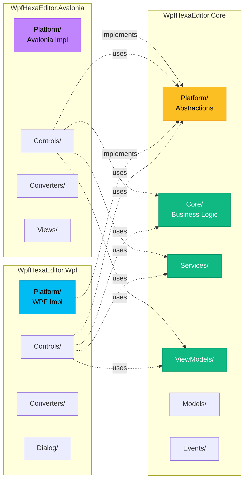

---

## 🎨 Platform Abstraction Layer Detail

```mermaid
graph TB
    subgraph "Platform Abstractions (Interfaces)"
        IDrawingContext["IDrawingContext<br/>━━━━━━━━━━<br/>+ DrawRectangle()<br/>+ DrawText()<br/>+ DrawLine()<br/>+ DrawEllipse()"]

        IBrush["IBrush<br/>━━━━━━━━━━<br/>+ IsFrozen<br/>+ Freeze()"]

        IPlatformTimer["IPlatformTimer<br/>━━━━━━━━━━<br/>+ Interval<br/>+ IsEnabled<br/>+ Tick event<br/>+ Start()/Stop()"]

        PlatformKey["PlatformKey (enum)<br/>━━━━━━━━━━<br/>A-Z, 0-9<br/>Arrow keys<br/>Function keys<br/>Special keys"]

        PlatformColor["PlatformColor (struct)<br/>━━━━━━━━━━<br/>+ A, R, G, B<br/>+ FromArgb()<br/>+ FromRgb()"]
    end

    subgraph "WPF Implementations"
        WpfDC["WpfDrawingContext<br/>━━━━━━━━━━<br/>wraps<br/>System.Windows.Media<br/>.DrawingContext"]

        WpfBrush["WpfBrush<br/>━━━━━━━━━━<br/>wraps<br/>SolidColorBrush"]

        WpfTimer["WpfDispatcherTimer<br/>━━━━━━━━━━<br/>wraps<br/>DispatcherTimer"]

        WpfConv["WpfKeyConverter<br/>━━━━━━━━━━<br/>System.Windows<br/>.Input.Key<br/>↓↑<br/>PlatformKey"]
    end

    subgraph "Avalonia Implementations"
        AvDC["AvaloniaDrawingContext<br/>━━━━━━━━━━<br/>wraps<br/>Avalonia.Media<br/>.DrawingContext"]

        AvBrush["AvaloniaBrush<br/>━━━━━━━━━━<br/>wraps<br/>ISolidColorBrush"]

        AvTimer["AvaloniaDispatcherTimer<br/>━━━━━━━━━━<br/>wraps<br/>DispatcherTimer"]

        AvConv["AvaloniaKeyConverter<br/>━━━━━━━━━━<br/>Avalonia.Input.Key<br/>↓↑<br/>PlatformKey"]
    end

    IDrawingContext -.->|implements| WpfDC
    IDrawingContext -.->|implements| AvDC

    IBrush -.->|implements| WpfBrush
    IBrush -.->|implements| AvBrush

    IPlatformTimer -.->|implements| WpfTimer
    IPlatformTimer -.->|implements| AvTimer

    PlatformKey -.->|converts| WpfConv
    PlatformKey -.->|converts| AvConv

    style IDrawingContext fill:#fbbf24,stroke:#f59e0b,color:#000
    style IBrush fill:#fbbf24,stroke:#f59e0b,color:#000
    style IPlatformTimer fill:#fbbf24,stroke:#f59e0b,color:#000
    style PlatformKey fill:#fbbf24,stroke:#f59e0b,color:#000
    style PlatformColor fill:#fbbf24,stroke:#f59e0b,color:#000

    style WpfDC fill:#00bcf2,stroke:#0099cc,color:#000
    style WpfBrush fill:#00bcf2,stroke:#0099cc,color:#000
    style WpfTimer fill:#00bcf2,stroke:#0099cc,color:#000
    style WpfConv fill:#00bcf2,stroke:#0099cc,color:#000

    style AvDC fill:#c084fc,stroke:#a855f7,color:#000
    style AvBrush fill:#c084fc,stroke:#a855f7,color:#000
    style AvTimer fill:#c084fc,stroke:#a855f7,color:#000
    style AvConv fill:#c084fc,stroke:#a855f7,color:#000
```

---

## 🏗️ HexEditor Control Architecture

```mermaid
graph TB
    subgraph "HexEditor Control (Platform-Specific)"
        HexEditor["HexEditor<br/>━━━━━━━━━━<br/>Main UserControl<br/>1,500+ lines<br/><br/>WPF: .xaml<br/>Avalonia: .axaml"]
    end

    subgraph "Child Controls (Custom Rendering)"
        HexViewport["HexViewport<br/>━━━━━━━━━━<br/>Main viewport<br/>Custom rendering<br/>535 lines OnRender<br/><br/>Uses IDrawingContext"]

        BarChart["BarChartPanel<br/>━━━━━━━━━━<br/>Frequency histogram<br/>171 lines OnRender<br/><br/>Uses IDrawingContext"]

        Caret["Caret<br/>━━━━━━━━━━<br/>Blinking cursor<br/>264 lines OnRender<br/><br/>Uses IDrawingContext<br/>Uses IPlatformTimer"]

        ScrollMarker["ScrollMarkerPanel<br/>━━━━━━━━━━<br/>Search markers<br/>291 lines<br/><br/>Uses IDrawingContext"]
    end

    subgraph "ViewModel Layer (Portable)"
        ViewModel["HexEditorViewModel<br/>━━━━━━━━━━<br/>INotifyPropertyChanged<br/><br/>• Position<br/>• Selection<br/>• Data<br/>• Commands"]
    end

    subgraph "Service Layer (Portable)"
        UndoRedo["UndoRedoService"]
        Search["SearchService"]
        Selection["SelectionService"]
        ByteData["ByteDataService"]
        Stream["StreamService"]
    end

    subgraph "Core Layer (Portable)"
        Bytes["Core/Bytes<br/>━━━━━━━━━━<br/>9,522 lines<br/><br/>• BaseByte<br/>• ByteProvider<br/>• ByteModified<br/>• ByteAction"]
    end

    HexEditor --> HexViewport
    HexEditor --> BarChart
    HexEditor --> Caret
    HexEditor --> ScrollMarker
    HexEditor --> ViewModel

    ViewModel --> UndoRedo
    ViewModel --> Search
    ViewModel --> Selection
    ViewModel --> ByteData
    ViewModel --> Stream

    UndoRedo --> Bytes
    Search --> Bytes
    Selection --> Bytes
    ByteData --> Bytes
    Stream --> Bytes

    HexViewport -.->|renders| Bytes

    style HexEditor fill:#0ea5e9,stroke:#0284c7,color:#fff
    style HexViewport fill:#8b5cf6,stroke:#7c3aed,color:#fff
    style BarChart fill:#8b5cf6,stroke:#7c3aed,color:#fff
    style Caret fill:#8b5cf6,stroke:#7c3aed,color:#fff
    style ScrollMarker fill:#8b5cf6,stroke:#7c3aed,color:#fff
    style ViewModel fill:#10b981,stroke:#059669,color:#fff
    style UndoRedo fill:#10b981,stroke:#059669,color:#fff
    style Search fill:#10b981,stroke:#059669,color:#fff
    style Selection fill:#10b981,stroke:#059669,color:#fff
    style ByteData fill:#10b981,stroke:#059669,color:#fff
    style Stream fill="#10b981,stroke:#059669,color:#fff
    style Bytes fill:#10b981,stroke:#059669,color:#fff
```

---

## 🔄 Rendering Flow (WPF vs Avalonia)

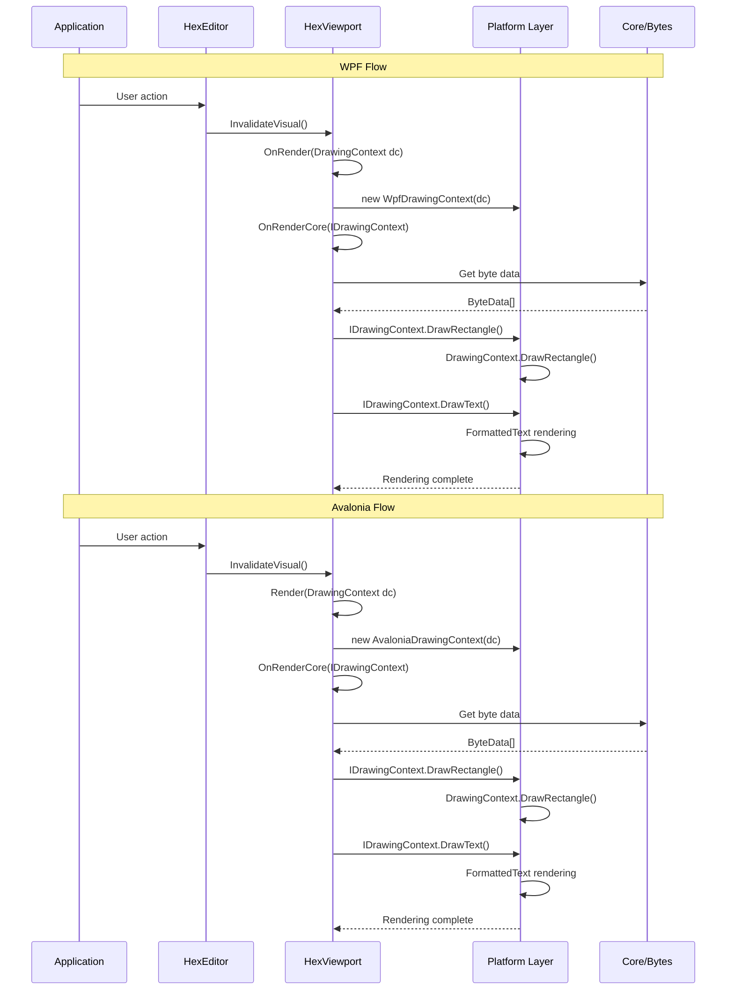

---

## 📦 NuGet Package Structure

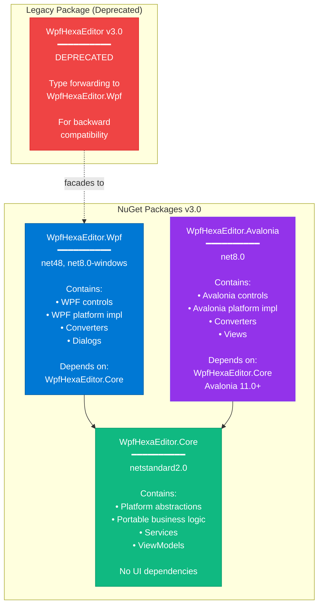

---

## 🎯 Migration Strategy - File Organization

### Before Migration (Current)
```
Sources/
└── WPFHexaEditor/
    ├── Core/                    ← Will move to Core project
    ├── Services/                ← Will move to Core project
    ├── ViewModels/              ← Will move to Core project
    ├── Models/                  ← Will move to Core project
    ├── Events/                  ← Will move to Core project
    ├── Controls/                ← Will stay (adapted)
    ├── Converters/              ← Will stay
    ├── Dialog/                  ← Will stay
    ├── Commands/                ← Will stay (adapted)
    └── WPFHexaEditor.csproj
```

### After Migration (Proposed)
```
Sources/
├── WpfHexaEditor.Core/          ← NEW
│   ├── Platform/                ← NEW (abstractions)
│   │   ├── Rendering/
│   │   ├── Media/
│   │   ├── Input/
│   │   └── Threading/
│   ├── Core/                    ← MOVED from WPFHexaEditor
│   ├── Services/                ← MOVED from WPFHexaEditor
│   ├── ViewModels/              ← MOVED from WPFHexaEditor
│   ├── Models/                  ← MOVED from WPFHexaEditor
│   └── Events/                  ← MOVED from WPFHexaEditor
│
├── WpfHexaEditor.Wpf/           ← RENAMED (was WPFHexaEditor)
│   ├── Platform/                ← NEW (WPF implementations)
│   ├── Controls/                ← ADAPTED (use abstractions)
│   ├── Converters/              ← KEPT
│   ├── Dialog/                  ← KEPT
│   └── Commands/                ← ADAPTED
│
└── WpfHexaEditor.Avalonia/      ← NEW
    ├── Platform/                ← NEW (Avalonia implementations)
    ├── Controls/                ← PORTED from Wpf
    ├── Converters/              ← PORTED from Wpf
    └── Views/                   ← NEW
```

---

## 🔌 Dependency Injection Pattern (Optional Enhancement)

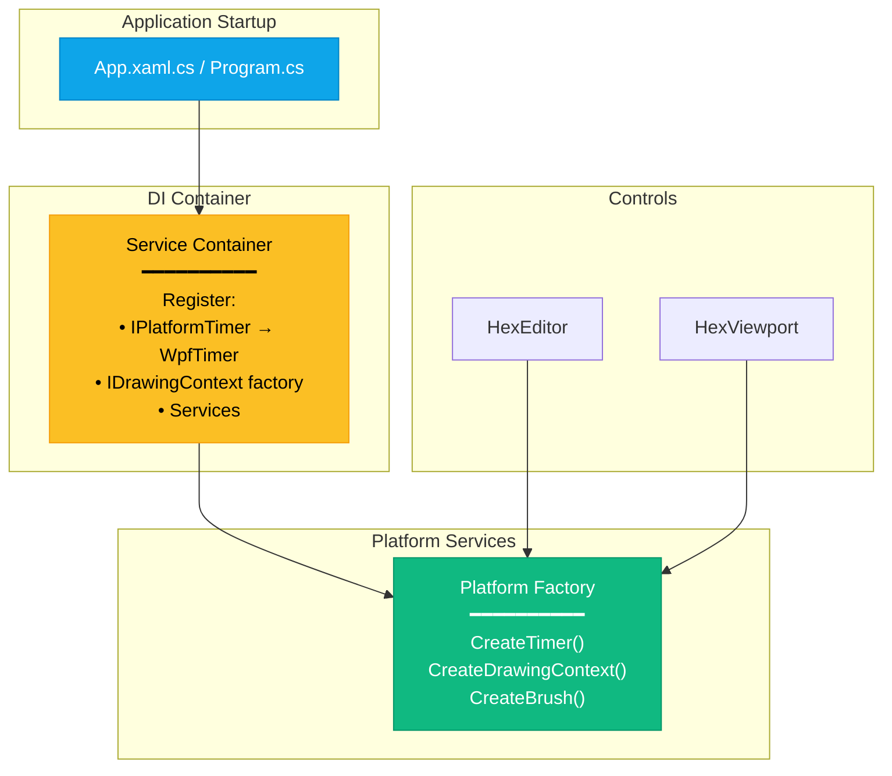

---

## 📊 Code Distribution Analysis

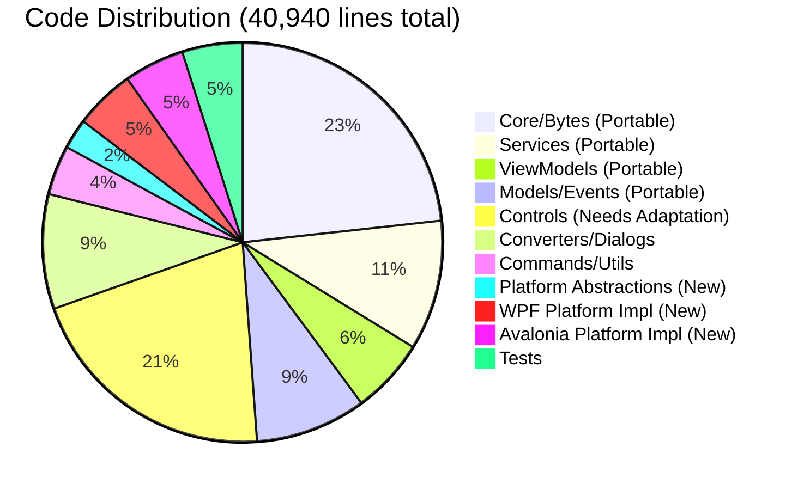

---

## 🎨 Theme Support Architecture

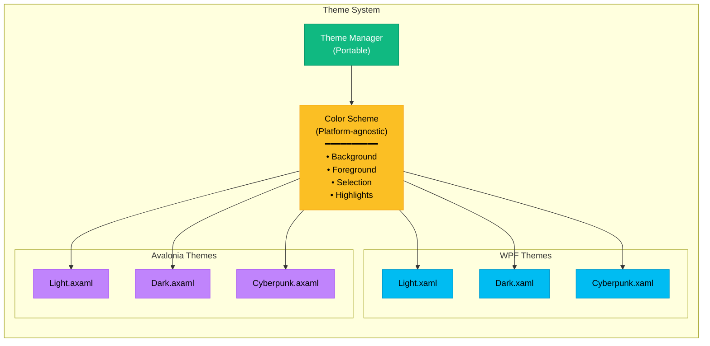

---

## 🧪 Testing Architecture

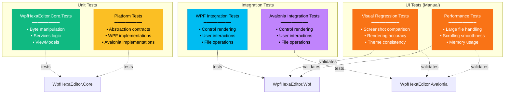

---

## 🚀 Build & CI/CD Pipeline

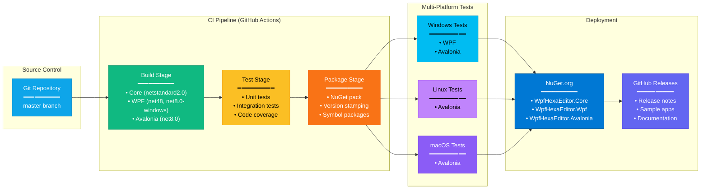

---

## 📈 Performance Optimization Strategy

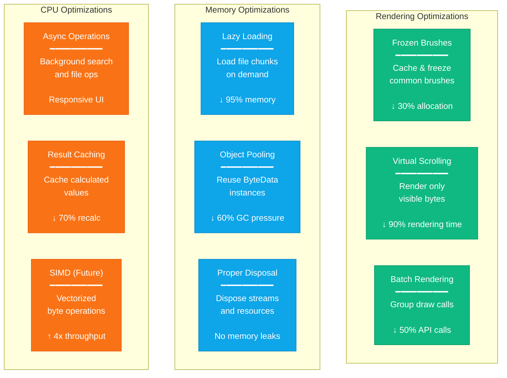

---

## 🎯 Summary

### Key Architectural Principles

1. **Minimal Abstraction**: Only abstract what's necessary for cross-platform
2. **Shared Core**: 85% of code is platform-agnostic
3. **Clean Separation**: UI layer completely separated from business logic
4. **Performance First**: Zero-overhead abstractions, caching, lazy loading
5. **Maintainability**: Clear project boundaries, single responsibility

### Benefits of This Architecture

✅ **Cross-platform**: Windows, Linux, macOS support via Avalonia
✅ **Maintainable**: Shared business logic reduces duplication
✅ **Testable**: Core logic fully testable without UI dependencies
✅ **Performant**: Minimal overhead, optimized rendering
✅ **Extensible**: Easy to add new platforms (MAUI, Uno, etc.)
✅ **Backward compatible**: WPF version continues to work

### Technical Debt Addressed

✅ Separation of concerns (V2 architecture enhanced)
✅ Dependency injection ready
✅ Platform independence
✅ Better testing infrastructure
✅ Modern .NET support (net8.0)

---

**Related Documents:**
- [AVALONIA_PORTING_PLAN.md](./AVALONIA_PORTING_PLAN.md) - Complete implementation plan
- [AVALONIA_PORTAGE_PLAN.md](./AVALONIA_PORTAGE_PLAN.md) - Plan complet en français

**Status:** 🟢 Architecture approved - Ready for implementation
**Last Updated:** 2026-02-16
